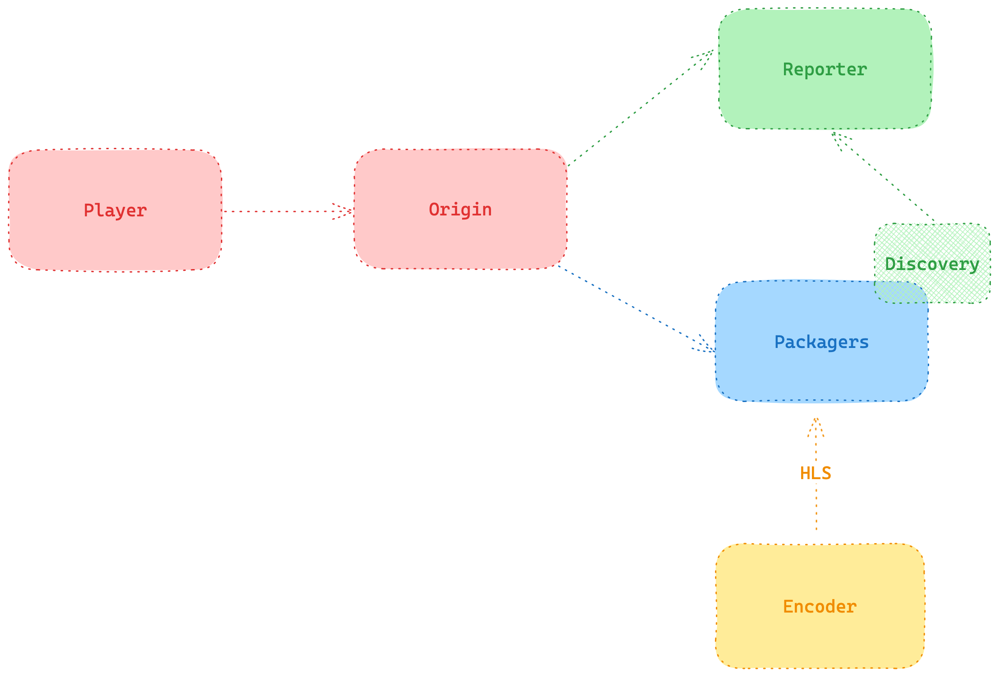

# Live Streaming Without Downtime (and with Go)

The true purpose of this project is to set up a zero downtime strategy for a Live Stream event.

We seek to emulate a live streaming platform architecture, as close to a real one as possible, like in the picture below - all using Golang (and a bit of FFMPEG).



## Publishing the Live Stream

First, For this, we use FFMPEG + Golang to produce an HLS playlist and publish it in two separate HTTP servers. This is done by running three different containers:

- **worker** - Builds and runs the FFMPEG command to generate a live stream output, whose manifest and segments are stored in the folder given by the `OUTPUT_STREAM_PATH` env variable. The input MP4 video used by the `worker` service to generate the FFMPEG is stored in the folder given by the env variable `INPUT_STREAM_PATH`.
- **server1** and **server2** - Each execute a different HTTP server with equal configurations but different ports (`SERVER_ONE_PORT` and `SERVER_TWO_PORT`).

These services can be run by calling, in different terminal tabs, the commands below - these will use the Go executable `go run` to start the services, but the option to use Docker instead is also available in the Makefile.

```sh
make run-local-worker
make run-local-server1
make run-local-server2
```

The output live stream will be an HLS playlist, which can be played in Safari or VLC using the following URLs:

```sh
localhost:8080/live01/playlist.m3u8 ## using server1
localhost:9090/live01/playlist.m3u8 ## using server2
```

This way, the **worker** service acts as our mock *encoder*, whose HLS content will be published by our mock *packagers*, represented by **server1** and **server2**.

## Reporting the Active Ingest

The next logical step is building a **discovery** and **reporter** service, which will be read by our **origin** to know which signals are active in which packagers. This information will be important for our **origin** to know from which packager to fetch the content from, and will be especially crucial for when we implement the zero downtime policy.

Thus, we now have two other containers, which also run separately:

- **discovery** - Reads the contents from the disk to verify which signals are being ingested (AKA generated by **worker**) and calls a healthcheck on all packagers (AKA **server1** and **server2**) to verify which are active. Then, it assembles all the gathered information and sends it to the **reporter** service using a HTTP POST. *OBS: Execution will fail if the **reporter** service is not active.*

```sh
2024-04-05 11:23:05 INF Registered signal 'live01' as ingest source
```

- **reporter** - Implements an API that receives the ingest information from the **discovery** service and stores it in a local cache. Then, it uses the information from the cache to expose a JSON with the active ingest information on the route `http://localhost:2000/ingests`:

```json
[
  {
    "signal": "live01",
    "packagers": [
      "http://localhost:8080",
      "http://localhost:9090"
    ],
    "last_reported": "Fri, 05 Apr 2024 11:23:45 -03"
  }
]
```

> :warning: Since both servers (**server1** and **server2**) and the **reporter** all implement different HTTP servers which will all be run on the same host `http://localhost`, to differentiate them, each service is executed on a different port: `:8080` for **server1**, `:9090` for **server2** and `:2000` for **reporter**. These values are controlled by the environment variables `SERVER_ONE_PORT`, `SERVER_TWO_PORT` and `REPORTER_PORT`, respectively.

To run these services, as was done in the previous section, we use the commands available in the Makefile (also running them in separate terminal tabs):

```sh
make run-local-discovery
make run-local-reporter
```

## Serving the Origin

The **origin** service connects all the services detailed before to the final client, such as a player or a playback/delivery API. The client sends a request for a signal and the **origin** service checks with the **reporter** service which _packager_ is being used to publish it, and then, returns the requested content to the client. 

To run this service, use the Makefile command below:

```sh
make run-local-origin
```

The **origin** runs on the `http://localhost:8001` endpoint, and it serves two routes.

The first `/signals` is used to return a list with the names of all active signals:

```sh
curl -v http://localhost:8001/signals
```

```json
[
  "live01"
]
```

The second, `/live/<name>`, receives the signal's name as a query parameter, and returns all active sources (AKA _packagers_) for this signal:

```sh
curl -v http://localhost:8001/live/live01
```

```json
{
  "signal": "live01",
  "server": "http://localhost:8080/live01/playlist.m3u8"
}
```

## Watching the Live Stream

To test the entire workflow and play the live stream using a playback client, execute all the services described previously in the following order:

- Discovery Server
  - Server 1
  - Server 2
    - Worker
- Reporter Server
- Origin Server

Then, open the Safari Browser or [VLC Player](https://www.videolan.org/vlc/) and play the signal url `http://localhost:8080/live01/playlist.m3u8`

## Zero Downtime Strategy

TBD